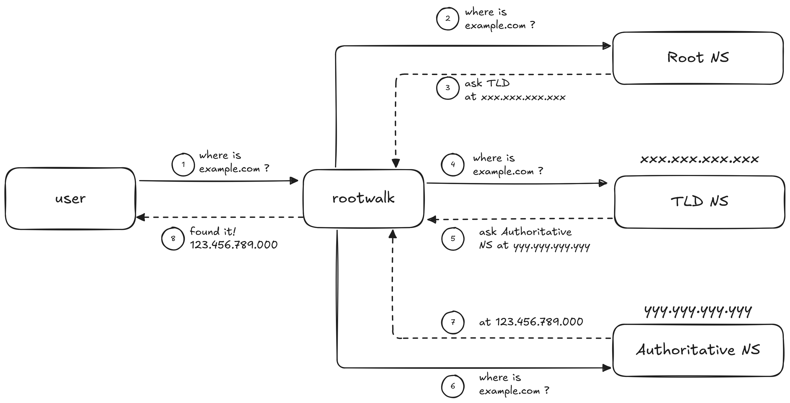

# rootwalk

rootwalk is a tiny DNS resolver I wrote to learn more about how 
DNS works and to practice writing Go. 

It's a simple recursive<sup>*</sup> 
resolver using only the Go standard library. It's meant 
to be used for educational purposes, you probably shouldn't depend 
on this in production :D.

rootwalk's purpose is to resolve a domain name starting from the 
root nameservers, it navigates the hierarchy of DNS nameservers 
and outputs the resolution journey.



<sup>*</sup> Recursive resolvers should support result caching 
by definition, this is a limitation in rootwalk.

# Usage

```shell
go build
./rootwalk <domain> <root>

# or
go run . <domain> <root>
```
Where:
- `domain` is the domain name to be resolved.
- `root` a value between `a` - `m` specifying which root server 
should be used, defaults to `a`.

# Output Example


# Limitations

- No caching
- Limited support for resource record types, only `A`, `AAA` and `NS` atm.

